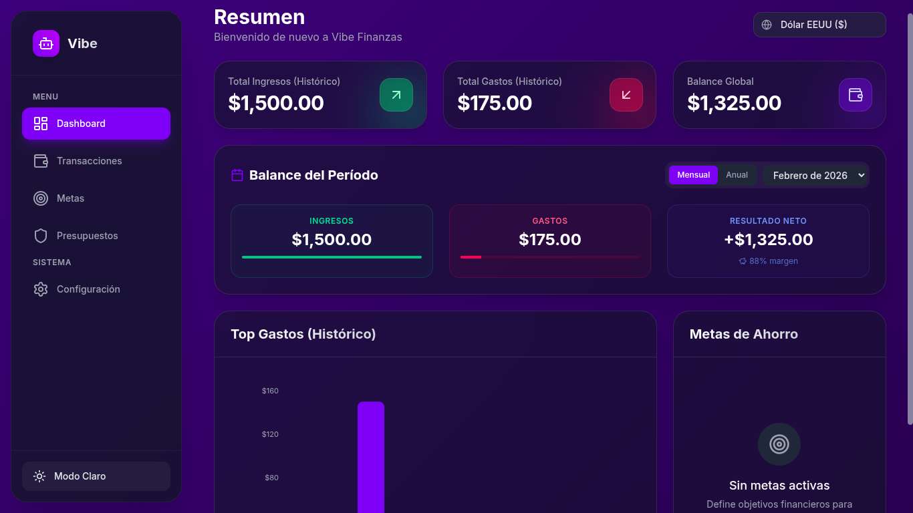

# 💰 Vibe Finance

<div align="center">
  
</div>

<p align="center">
  <a href="https://vibe-finance-psi.vercel.app">
    
  </a>
  <a href="https://github.com/VictorR29/vibe-finance">
    
  </a>
  
  
</p>

## 🎯 Gestiona tus finanzas personales de forma inteligente

**Vibe Finance** es una aplicación web progresiva (PWA) diseñada para ayudarte a controlar tus gastos, ingresos, presupuestos y metas de ahorro de manera sencilla y visual.

### ✨ Características Principales

- 📊 **Dashboard Intuitivo**: Visualiza tus finanzas con gráficos y estadísticas claras
- 💳 **Registro de Transacciones**: Controla ingresos y gastos con categorías personalizables
- 🎯 **Metas de Ahorro**: Establece objetivos financieros y sigue tu progreso
- 💵 **Presupuestos Mensuales**: Administra tus límites de gasto por categoría
- 📱 **PWA Instalable**: Instálala en tu móvil o desktop como una app nativa
- 🌙 **Modo Oscuro/Claro**: Interfaz adaptable a tu preferencia
- 💾 **Datos Persistentes**: Toda la información se guarda localmente en tu dispositivo
- 📤 **Exportar/Importar**: Realiza respaldos y restaura tus datos fácilmente
- ⚡ **Rápida y Optimizada**: Construida con Vite para máximo rendimiento

### 🚀 Demo en Vivo

**👉 [https://vibe-finance-psi.vercel.app](https://vibe-finance-psi.vercel.app)**

Prueba la aplicación directamente en tu navegador. Puedes instalarla en tu dispositivo para usarla offline.

### 📸 Capturas de Pantalla

<div align="center">
  
</div>

### 🛠️ Stack Tecnológico

- **Frontend**: React 19 + TypeScript
- **Build Tool**: Vite 6
- **Estilos**: Tailwind CSS
- **Gráficos**: Recharts
- **Almacenamiento**: IndexedDB (local)
- **PWA**: Service Worker + Manifest
- **Deploy**: Vercel

### 📦 Instalación Local

```bash
# Clonar el repositorio
git clone https://github.com/VictorR29/vibe-finance.git

# Entrar al directorio
cd vibe-finance

# Instalar dependencias
npm install

# Iniciar servidor de desarrollo
npm run dev
```

La aplicación estará disponible en `http://localhost:3000`

### 🏗️ Construcción para Producción

```bash
npm run build
```

Los archivos optimizados se generarán en la carpeta `dist/`.

### 📱 Instalación como PWA

**En Android (Chrome):**
1. Visita la app en Chrome
2. Toca el menú (⋮) → "Agregar a pantalla de inicio"

**En iOS (Safari):**
1. Visita la app en Safari
2. Toca Compartir → "Agregar a Inicio"

**En Desktop (Chrome/Edge):**
1. Visita la app
2. Aparecerá el ícono de instalación en la barra de direcciones
3. Click → "Instalar Vibe Finance"

### 🔒 Privacidad y Seguridad

- ✅ **100% Privada**: Tus datos nunca salen de tu dispositivo
- ✅ **Sin Servidores**: Todo se almacena localmente en IndexedDB
- ✅ **Sin Cuentas**: No requiere registro ni login
- ✅ **Tus Datos**: Exporta tus datos en cualquier momento como respaldo

### 🐛 Reportar Problemas

Si encuentras algún error o tienes sugerencias, por favor abre un [issue](https://github.com/VictorR29/vibe-finance/issues).

### 🤝 Contribuir

Las contribuciones son bienvenidas. Por favor:

1. Fork el repositorio
2. Crea una rama (`git checkout -b feature/nueva-funcionalidad`)
3. Commit tus cambios (`git commit -m 'Agrega nueva funcionalidad'`)
4. Push a la rama (`git push origin feature/nueva-funcionalidad`)
5. Abre un Pull Request

### 👨‍💻 Autor

**VictorR29**

- GitHub: [@VictorR29](https://github.com/VictorR29)

### 📝 Licencia

Este proyecto está bajo la Licencia MIT. Ver el archivo [LICENSE](./LICENSE) para más detalles.

---

<div align="center">
  <p>Hecho con ❤️ y ☕ por VictorR29</p>
  <p>
    <a href="https://vibe-finance-psi.vercel.app">🚀 Ver App</a> •
    <a href="https://github.com/VictorR29/vibe-finance">📂 GitHub</a>
  </p>
</div>
